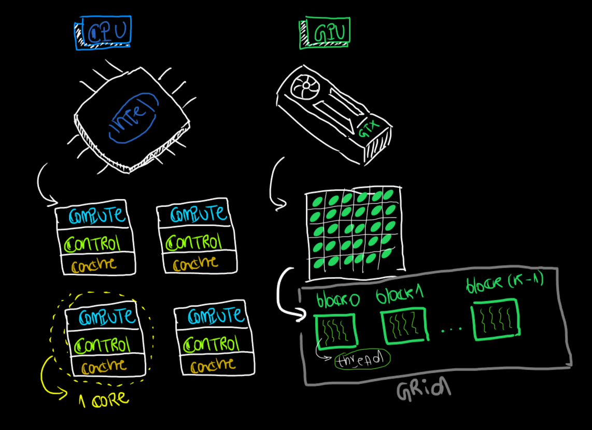

# Diferença entre GPU e CPU

- `CPU` (Central Processing Unit) tem poucos núcleos *(núcleos: são unidades individuais de processamento dentro de um único chip de CPU)*, são focadas em trabalhos sequencias, faz tarefas complexas com muita eficiencia
- `GPU` (Graphics Processing Unit) foi criada inicialmente para lidar com gráficos, possui milhares de núcleos menores (mais simples), é **excelente** para tarefas paralelas 

# Host vs Device
- `Host`: é a `CPU` onde seu código começa a rodar
- `Device`: geralmente é a `GPU` o acelerador

# Kernel
O `kernel` é uma **função** que **roda** na GPU (device). Resumidamente o `kernel` é o trabalho que a GPU vai fazer.
```cpp
// Na cpu você faria
for (int i = 0; i < N; i++) {
    w[i] = v[i] + u[i]  // isso é sequencial
}
// No seu kernel na GPU você pode fazer
w[i] = v[i] + u[i];  // isso é PARALELO, cada thread vai trabalhar no seu elemento e retornar o vetor w.
```
Como analogia podemos pensar assim:
1. Kernel: instrução dada para a GPU;
2. Threads: cada bloquinho trabalhador que vai processar (fazer o que deve ser feito)
3. GPU: onde tudo isso mora.

# Funções kernel `__global__`, `__device__`, `__host__`:
Esses dunders (__dunder__) dizem onde a função roda e quem pode chamar essa função (qual dispositivo `CPU` ou `GPU` podem solicitar sua rodada)
- `__global__`
    - Roda: GPU
    - Quem chama: CPU
    - Uso principal: Kernel
- `__device__`
    - Roda: GPU
    - Quem chama: GPU
    - Uso principal: Função auxiliar
- `__host__`: 
    - Roda: CPU
    - Quem chama: CPU
    - Uso principal: Função normal

```cpp
/*
- Executa na GPU
- Chamado pela CPU
- Executa em milhares de threads
*/
__global__ void myKernel() {
    // roda na GPU
}
// A CPU chama a função (kernel)
myKernel<<<blocos, threads>>>();

/*
- Executa na GPU
- Só pode ser chamado por outras funções na GPU
- Não pode ser chamada diretamente pela CPU
*/
__device__ float sum(float x, float y) {
    return x + y;
}

__global__ void kernel(float *x) {
    int i = threadIdx.x;
    x[i] = sum(x[i], 2.0)  // chama a função device
}
/*
- Executa na CPU
- É C++ normal não precisa adicionar __host__
*/
__host__ void funcaoCPU() {
    // roda na CPU
}

// Roda na CPU ou na GPU mas não pode ter comandos que só funcionam em um deles
__host__ __device__ float rodaCPUGPU(float x, float y) {
    return x + y
}
```

O fluxo é dado por:
1. CPU (`__host__`)
    - Prepara os dados;
    - Manda para a GPU
2. CPU chama `__global__` (kernel)
3. GPU executa:
    - kernel (`__global__`)
    - funções auxiliares (`__device__`)
4. CPU pega de volta o resultado.

# `threadIdx`, `blockIdx`, `blockDim`, `gridDim`
Primeiro precisamos entender alguns conceitos, uma `GPU` organiza sua execução em **3** níveis:
- Grid: Vários Blocos;
- Bloco: Várias threads;
- Thread: Executores

Agora podemos entender os campos: `threadIdx`, `blockIdx`, `blockDim`, `gridDim`.
- `threadIdx`: Busca responder, quem sou eu dentro do bloco? Identifica qual é aquela `thread` dentro do bloco, por exemplo se um bloco tem 4 threads:
```txt
[0] [1] [2] [3]
 ↑   ↑   ↑   ↑
threadIdx.x → cada thread tem um ID diferente.
```
- `blockIdx`: Busca responder, em qual bloco eu estou? Isso identifica o bloco dentro do `grid`:
```txt
[bloco 0] [bloco 1] [bloco 2]
```
- `blockDim`: Quantas `threads` tem em cada `bloco`? Um bloco com 4 `threads` possui `blockDim` = 4.
- `gridDim`: Quantos `blocos` existem? Esse é o tamanho do grid.
Com isso encontramos o indice onde cada processamento irá acontecer:
```cpp
int i = threadIdx.x + blockIdx.x * blockDim.x;
/*
BLOCO 0:
i = 0 + 0*4 = 0
i = 1 + 0*4 = 1
i = 2 + 0*4 = 2
i = 3 + 0*4 = 3
---
BLOCO 1:
i = 0 + 1*4 = 4
i = 1 + 1*4 = 5
i = 2 + 1*4 = 6
i = 3 + 1*4 = 7
---
BLOCO 2:
i = 0 + 2*4 = 8
i = 1 + 2*4 = 9
i = 2 + 2*4 = 10
i = 3 + 2*4 = 11
*/
suaFuncao<<<3 blocos, 4 threads>>>()
```
Representação:
```txt
Bloco 0: [0] [1] [2] [3]
Bloco 1: [0] [1] [2] [3]
Bloco 2: [0] [1] [2] [3]
```

Em resumo:
- `threadIdx`: posição local
- `blockIdx`: posição do grupo
- `blockDim`: tamanho do grupo
- `gridDim`: quantidade de grupos

Uma GPU é como um **planilha**:
- `grid`: planilha inteira
- `bloco`: linha
- `thread`: célula

`i` = posição global da célula

`CUDA` é naturalmente multidimensional as variáveis:
- `threadIdx`
- `blockIdx`
- `blockDim`
- `gridDim`
São `structs` com 3 dimensões. sendo assim possuem além de `.x`, `.y` e `.z` também.
```cpp
threadIdx.x  // posição em x
threadIdx.y  // posição em x
threadIdx.z  // posição em x
```
Usamos apenas `.x` quando o problema é **1D**, usamos `.y` e `.z` quando o problema é **2D** ou **3D** respectivamente.
```cpp
int x = threadIdx.x + blockIdx.x * blockDim.x;
int y = threadIdx.y + blockIdx.y * blockDim.y;
/*
(0,0) (1,0) (2,0)
(0,1) (1,1) (2,1)
(0,2) (1,2) (2,2)
*/
```
- `.x`: direção horizontal
- `.y`: vertical
- `.z`: profundidade

# Por que quase todo kernel começa com:
```c++
int i = blockIdx.x * blockDim.x + threadIdx.x;
```
Como explicado acima isso encontra a posição global da thread que irá realizar o processamento de cada elemento. Mas agora surge a dúvida do motivo de se fazer esse tipo de calculo.

Fazemos isso pois estamos transformando uma estrutura **2D (blocos × threads)** em um índice **1D (linear)**. Na memória tudo é linear. Um `tensor` é dado por:
1. Memória: A memoria é salva `linearmente` ela não tem shape;
2. Shape: O `tensor` possui shape bem definido;
3. Stride: Como navegamos pela memória
``` py
x = torch.randn(2, 3)
```
```txt
Memória:
[ x00, x01, x02, x10, x11, x12 ]

Shape:
(2, 3)

Stride:
(3, 1)
```
O `Stride` nos diz *"Para ir para a próxima linha, pule 3 para ir para a próxima coluna pule 1 na memória que você acessara os valores."*
Sendo assim seu `tensor` vira **1D**?
- Do ponto de vista lógico: `NÃO`
- Do ponto de vista físico: `SIM`

Quando fazemos:
```py
x = torch.randn(2, 3)
y = x.t()  # transpose
```
- Shape muda;
- Stride muda;
- Memória continua a mesma

Quando usamos:
```py
y.contiguous()
```
Movemos os dados para ficarem lineares novamente na memória pois quando usamos `x.t()` mudamos o shape o stride mas não mudamos a memória, o `y.contiguous()` reorganiza os dados na memória `linear` para eles continuarem `lineares`. `transpose()`, `permute()`, `view()`, não movem os dados, `contiguous()` move os dados. E isso é importante pois ajuda na hora de fazer o manuseio do seu tensor e aumenta a velocidade das operações, pois a memória está `linear`.
Em resumo:
- `contiguous()` não muda o tensor — muda como ele vive na memória.

# Como chamar uma função cuda (kernel):
```cpp
suaFuncao<<<n_blocos, threads_por_bloco>>>(parametros_da_sua_funcao);
```
Isso não é apenas a chamada de uma função, isso é um `kernel launch`. Isso acontece porque na `GPU` é preciso falar explicitamente:
1. Quanto paralelismo você quer;
2. Como dividir o trabalho.
E ai dentro do seu `kernel`cada `thread` descobre quem ela é `i` e em qual pedaço do problema ela irá trabalhar.
- `<<<...>>>`: “como eu quero paralelizar”

# O que acontece quando o nosso `Tensor` tem mais elementos do que a GPU tem de `threads`:
Quando isso ocorre precisamos fazer um `for`, mesmo sendo paralelo ela tem limitações e por conta disso precisamos sair da execução paralela e fazer sequencial, usamos os threads disponiveis (execução paralela) e depois fazemos a passagem para o proximo pedaço de elementos que estava esperando `threads` livres.

```cpp
__global__ void kernel(float* x, int N) {
    int i = threadIdx.x + blockIdx.x * blockDim.x;

    while (i < N) {
        x[i] *= 2;
        i += blockDim.x * gridDim.x;
    }
}
```

# Memory

## 1. Memória básica: **global**

## 2. Global Memory

## 3. Registers

## 4. O que significa acesso coalescido?

# O que é o Triton
> Triton = kernels CUDA escritos em Python, com um compilador focado em workloads de ML.

# Prática em CUDA e no Triton
- Soma de vetores
- Multiplicação de vetores
- ReLU
- Sigmoid
- Softmax
- Convolução simples