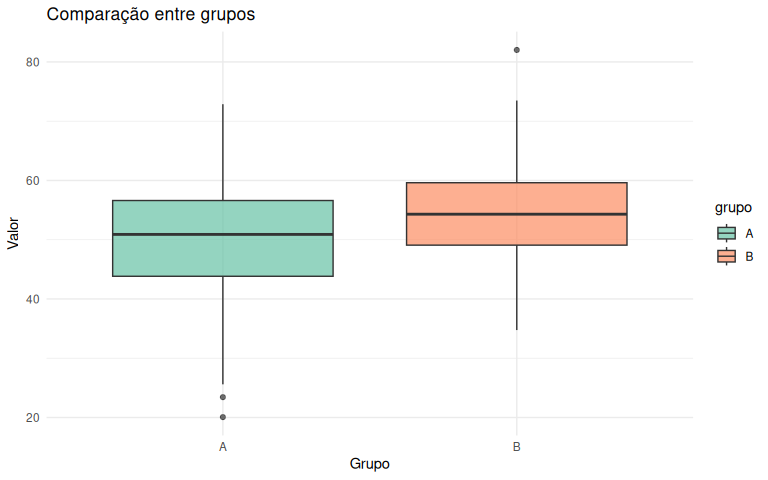

## Bibliotecas

Carregando as bibliotecas necessárias para análise:

``` r
library(dplyr)
library(ggplot2)
```

## Configuração

Definindo seed para reprodutibilidade:

``` r
set.seed(42)
```

## Criação dos Dados

Gerando dois grupos aleatórios com distribuição normal:

-   **Grupo A:** média = 50, desvio padrão = 10
-   **Grupo B:** média = 55, desvio padrão = 10

``` r
# Cria dois grupos aleatórios
grupo_a <- rnorm(100, mean = 50, sd = 10)
grupo_b <- rnorm(100, mean = 55, sd = 10)

# Faz o DataFrame com eles
dados <- data.frame(
  valor = c(grupo_a, grupo_b),
  grupo = rep(c("A", "B"), each = 100)
)

# Visualiza primeiras linhas
head(dados)
```

    ##      valor grupo
    ## 1 63.70958     A
    ## 2 44.35302     A
    ## 3 53.63128     A
    ## 4 56.32863     A
    ## 5 54.04268     A
    ## 6 48.93875     A

## Visualização dos Dados

Comparação visual entre os grupos usando boxplot:

``` r
ggplot(dados, aes(x = grupo, y = valor, fill = grupo)) +
  geom_boxplot(alpha = 0.7) +
  theme_minimal() +
  labs(
    title = "Comparação entre grupos",
    x = "Grupo",
    y = "Valor"
  ) +
  scale_fill_brewer(palette = "Set2")
```


<p class="caption">
Figura 1: Distribuição dos valores por grupo
</p>

## Teste T de Student

Realizando o teste t para comparar as médias dos dois grupos:

**Hipóteses:**

-   **H0 (Hipótese Nula):** Não há diferença significativa entre as
    médias dos grupos
-   **H1 (Hipótese Alternativa):** Há diferença significativa entre as
    médias dos grupos

``` r
# Faz o teste t
teste <- t.test(valor ~ grupo, data = dados)
teste
```

    ## 
    ##  Welch Two Sample t-test
    ## 
    ## data:  valor by grupo
    ## t = -2.7554, df = 194.18, p-value = 0.00642
    ## alternative hypothesis: true difference in means between group A and group B is not equal to 0
    ## 95 percent confidence interval:
    ##  -6.519980 -1.080049
    ## sample estimates:
    ## mean in group A mean in group B 
    ##        50.32515        54.12516

## Interpretação do P-value

``` r
# Pega o p-value
p_value <- teste$p.value
cat("P-value:", round(p_value, 4), "\n\n")
```

    ## P-value: 0.0064

``` r
# Rejeita ou não rejeitamos H0
if (p_value < 0.05) {
  cat("**Conclusão:** Rejeitamos H0\n")
  cat("Existe diferença significativa entre os grupos (p < 0.05).\n")
} else {
  cat("**Conclusão:** Não rejeitamos H0\n")
  cat("Não há evidência suficiente de diferença (p ≥ 0.05).\n")
}
```

    ## **Conclusão:** Rejeitamos H0
    ## Existe diferença significativa entre os grupos (p < 0.05).

## Estatísticas Descritivas

Resumo estatístico por grupo:

``` r
estatisticas <- dados %>%
  group_by(grupo) %>%
  summarise(
    media = mean(valor),
    desvio_padrao = sd(valor),
    n = n(),
    mediana = median(valor),
    min = min(valor),
    max = max(valor)
  )

knitr::kable(
  estatisticas,
  digits = 2,
  caption = "Tabela 1: Estatísticas descritivas por grupo",
  col.names = c("Grupo", "Média", "Desvio Padrão", "N", "Mediana", "Mínimo", "Máximo")
)
```

| Grupo | Média | Desvio Padrão |   N | Mediana | Mínimo | Máximo |
|:------|------:|--------------:|----:|--------:|-------:|-------:|
| A     | 50.33 |         10.41 | 100 |   50.90 |  20.07 |  72.87 |
| B     | 54.13 |          9.04 | 100 |   54.31 |  34.75 |  82.02 |

Tabela 1: Estatísticas descritivas por grupo

## Resumo

### Resultados Principais

-   **Grupo A:** Média = 50.33 (DP = 10.41 )
-   **Grupo B:** Média = 54.13 (DP = 9.04 )
-   **Diferença entre médias:** 3.8
-   **P-value:** 0.0064
-   **Nível de significância:** α = 0.05
